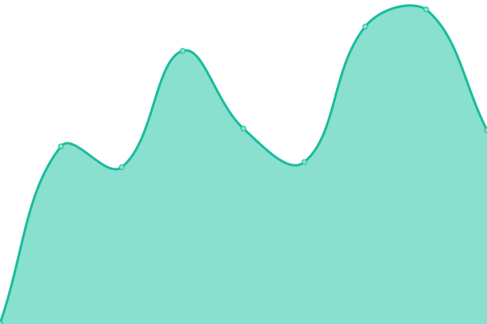

# [📈 Live Status](https://UAB-OPL.github.io/opl-uab-monitoring): <!--live status--> **🟧 Partial outage**

This repository contains the open-source uptime monitor and status page for [UAB-OPL](https://UAB-OPL.github.io/opl-uab-monitoring), powered by [Upptime](https://github.com/upptime/upptime).

With [Upptime](https://upptime.js.org), you can get your own unlimited and free uptime monitor and status page, powered entirely by a GitHub repository. We use [Issues](https://github.com/UAB-OPL/opl-uab-monitoring/issues) as incident reports, [Actions](https://github.com/UAB-OPL/opl-uab-monitoring/actions) as uptime monitors, and [Pages](https://UAB-OPL.github.io/opl-uab-monitoring) for the status page.

<!--start: status pages-->
<!-- This summary is generated by Upptime (https://github.com/upptime/upptime) -->
<!-- Do not edit this manually, your changes will be overwritten -->
<!-- prettier-ignore -->
| URL | Status | History | Response Time | Uptime |
| --- | ------ | ------- | ------------- | ------ |
|  [Web OPL](https://opl.uab.cat) | 🟥 Down | [web-opl.yml](https://github.com/UAB-OPL/opl-uab-monitoring/commits/HEAD/history/web-opl.yml) | 

 0ms
     
 | 

<a href="https://UAB-OPL.github.io/opl-uab-monitoring/history/web-opl">0.07%</a>
    

|  [Migasfree Server OPL](https://migasfree.opl.uab.cat) | 🟥 Down | [migasfree-server-opl.yml](https://github.com/UAB-OPL/opl-uab-monitoring/commits/HEAD/history/migasfree-server-opl.yml) | 

 0ms
     
 | 

<a href="https://UAB-OPL.github.io/opl-uab-monitoring/history/migasfree-server-opl">0.07%</a>
    

|  [Mirrors OPL](http://mirrors.opl.uab.cat) | 🟥 Down | [mirrors-opl.yml](https://github.com/UAB-OPL/opl-uab-monitoring/commits/HEAD/history/mirrors-opl.yml) | 

 0ms
     
 | 

<a href="https://UAB-OPL.github.io/opl-uab-monitoring/history/mirrors-opl">0.07%</a>
    

|  [Google](https://www.google.com) | 🟩 Up | [google.yml](https://github.com/UAB-OPL/opl-uab-monitoring/commits/HEAD/history/google.yml) | 

 67ms
     
 | 

<a href="https://UAB-OPL.github.io/opl-uab-monitoring/history/google">100.00%</a>
    

|  [Test Broken Site](https://thissitedoesnotexist.koj.co) | 🟥 Down | [test-broken-site.yml](https://github.com/UAB-OPL/opl-uab-monitoring/commits/HEAD/history/test-broken-site.yml) | 

 0ms
     
 | 

<a href="https://UAB-OPL.github.io/opl-uab-monitoring/history/test-broken-site">100.00%</a>
    

<!--end: status pages-->

[**Visit our status website →**](https://UAB-OPL.github.io/opl-uab-monitoring)

## 📄 License

- Powered by: [Upptime](https://github.com/upptime/upptime)
- Code: [MIT](./LICENSE) © [UAB-OPL](https://UAB-OPL.github.io/opl-uab-monitoring)
- Data in the `./history` directory: [Open Database License](https://opendatacommons.org/licenses/odbl/1-0/)
